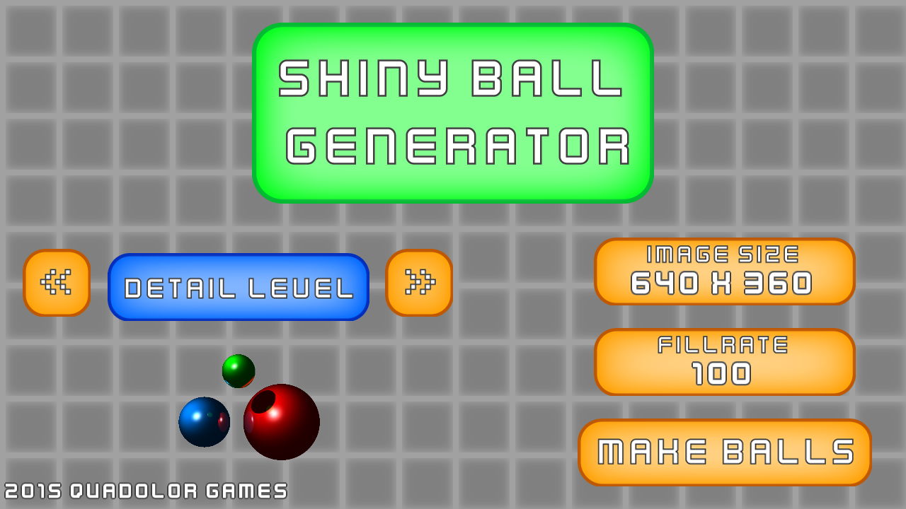
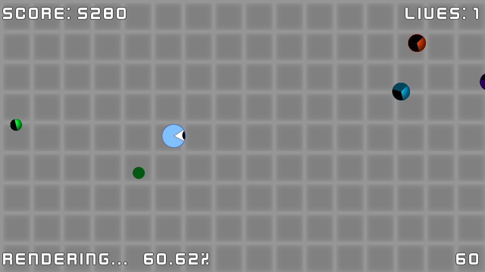
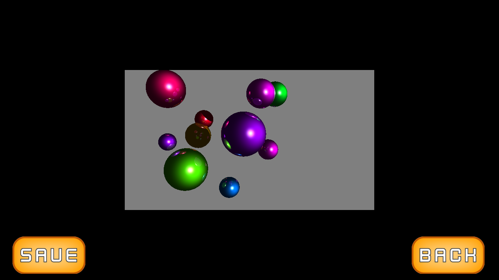
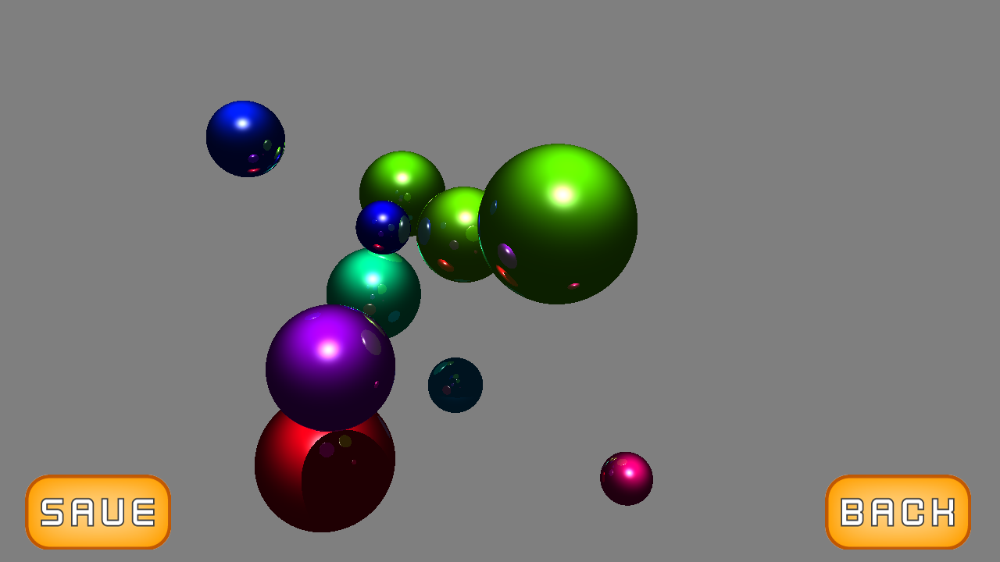
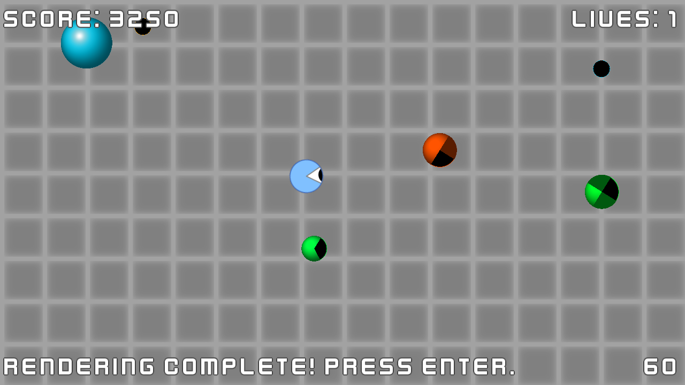

# Shiny Ball Generator

    

A **custom raytracer** written in **GML**. Runs a simple Asteroid clone in the foreground to allow you to kill some time while the scene renders in the background.

**Stable:** *[2.1.1](https://github.com/mstop4/ShinyBallGenerator/releases/tag/2.1.1)* - Windows, Mac, Linux  

## Screenshots

<table border="0">
    <tr>
        <td></td>
        <td></td>
    <tr>
    <tr>
        <td></td>
        <td></td>
    <tr>
</table>
